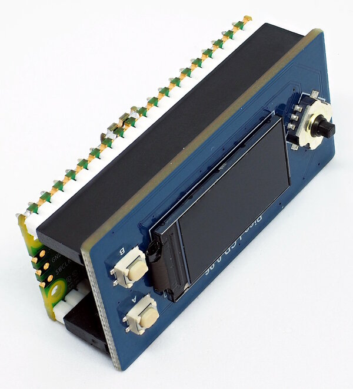
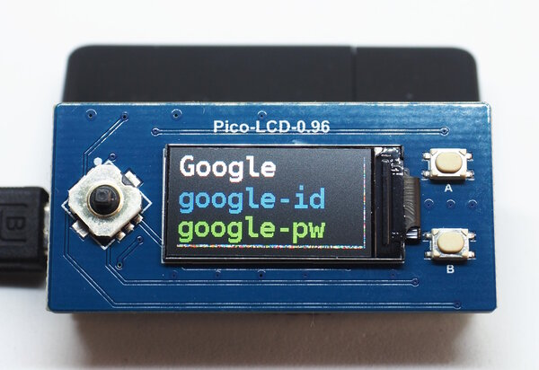

Password-Helper
===============

This little project implements a password helper based on
a Raspberry Pi Pico and a Waveshare 0.96" display attached
to the back of the Pico.

Operation is simple: the device acts as a keyboard. You navigate
(e.g. with the mouse) to the respective fields on the login-screen,
select the entry for the site with the navigation-button on the left
side of the display and use the other buttons to send username
and password.

To obfuscate the real purpose of the device, it starts up in
"slide-show"-mode. The buttons will only iterate the images on
the device (some sample images are provided within this repository).
The program switches to password-helper mode if the navigation
button is pressed while the correct image is displayed. The correct
image is the image with the number `KEY_IMAGE` (see `main.py`).
You should change this on your device.

Installation
------------

You need to install [CircuitPython](https://circuitpython.org)
on your Pico. Then, clone this repository to your PC/Laptop
and copy all files from the directory `src` to the Pico.

In addition to the files distributed with this project, you need
a number of libraries:

  - adafruit_display_text
  - adafruit_bitmap_font
  - adafruit_hid
  - adafruit_st7735r

The easiest way to install these libraries is to use circup. You
can install circup with

    sudo pip3 install circup

and then run

    circup [--path path-to-your-device] install adafruit_display_text ...

You only have to supply the path-information if circup does not detect
your device automatically.

If you use any other language than German, you also have to adapt the
code: in the file `src/main.py` you will find a method `_setup_hid()`
that loads the German keyboard-layout from `keyboard_layout_win_de`.
Layouts for other languages are provided by
<https://github.com/Neradoc/Circuitpython_Keyboard_Layouts>. The layout
for English is part of CircuitPython itself.

Configuration
-------------

You have to supply a password list in a file called `secrets.py`.
The format is a list of tuples, e.g.:

    secrets = [
      ('Amazon','ama-id','ama-pw'),
      ('Ebay','ebay-id','ebay-pw'),
      ('Google','google-id','google-pw'),
      ('Reichelt','reichelt-id','reichelt-pw'),
      ('Adafruit','ada-id','ada-pw')
    ]

Also, you should supply your own images, and update the variables
`IMAGES` and `KEY_IMAGE` in `main.py`.

Security
--------

*Important:*

Although the device obfuscates it's purpose, it will not be difficult
for a hacker to extract the password-list from the device. So this
gadget is not much safer than a printed password list. Keep the device
safe and use it on your own risk!

Porting to other Hardware
-------------------------

The code in this project is explicitly written for the Waveshare 0.96"
display which also has all the buttons the project needs. Porting to
other hardware is simple.

For other displays you might have to change the driver in the method
`_setup_hw()` and the GPIOs you connect to the display.

Replacing the buttons is also simple, you can find on eBay breakouts
with exactly the buttons you find on the display, i.e. a navigation
button (5-directions) combined with two additional (set/reset) buttons.
